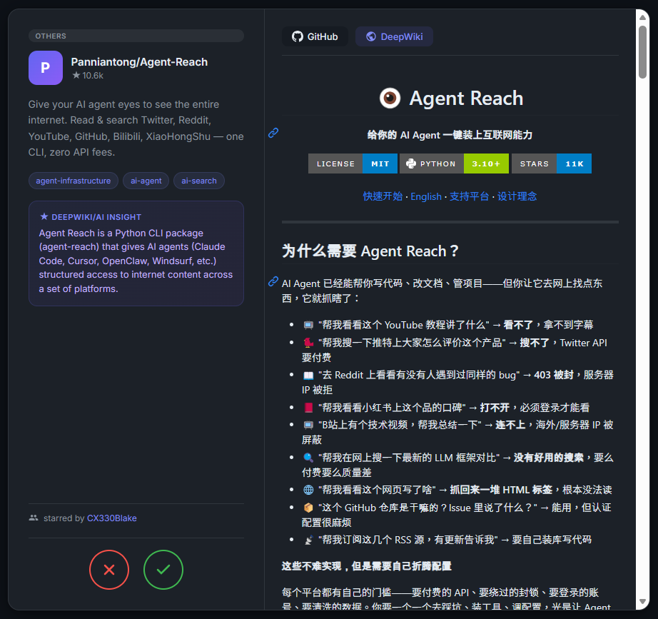

# StarGazer Newsletter

Discover what your GitHub network is starring. Generates a weekly newsletter (GitHub Issue) and a swipe UI (GitHub Pages) to browse repos starred by people you follow.


## Setup

1. Fork this repo
2. Add `GH_PAT` in repo secrets — a Personal Access Token with `read:user` and `user:follow` scopes
3. (Optional) Add one of these for AI insights: `ANTHROPIC_API_KEY`, `OPENAI_API_KEY`, or `GEMINI_API_KEY`
4. Enable GitHub Pages in repo settings (source: GitHub Actions)
5. Trigger the workflow manually or wait for the Monday 9 AM UTC cron


## Schedule

```
cron: '0 9 * * 1'  # Monday 9:00 AM UTC
```

Also supports manual trigger via `workflow_dispatch` with mode selection.

## Sample

See newsletter samples in [Issues](https://github.com/laudantstolam/stargazer_newsletter/issues)


## Configuration

| Env Variable | Required | Description |
|---|---|---|
| `GH_PAT` | Yes | GitHub PAT with `read:user`, `user:follow` |
| `DAYS` | No | Lookback window in days (default: 7) |
| `ANTHROPIC_API_KEY` | No | Claude API key for AI insights |
| `OPENAI_API_KEY` | No | OpenAI API key (fallback) |
| `GEMINI_API_KEY` | No | Gemini API key (fallback) |


## Features

- **Weekly Newsletter** — auto-posted as a GitHub Issue with trending repos, topics, shared interests, and weak-signal discoveries
- **Swipe UI** — card-based interface with flip animations, category navigation, and dynamic README loading. Swipe right to open, left to skip
- **AI Insights** — 3-tier pipeline: DeepWiki (free) → LLM (Claude/OpenAI/Gemini) → no insight. Minimizes token cost by trying free sources first
- **Categorized Cards** — repos sorted into Trending, Shared Interest, Weak Signal, and Other with category badges and a jump-to navigator


## How It Works

The pipeline runs weekly via GitHub Actions in parallel stages:

1. **Fetch** — collects followed users' recent stars (past 7 days) and repo metadata
2. **Insights** — generates AI insights in 4 parallel chunks (DeepWiki → LLM fallback)
3. **Newsletter** — creates a GitHub Issue summarizing trends (runs independently)
4. **Swipe UI** — builds a self-contained `dist/index.html` with categorized cards
5. **Deploy** — publishes to GitHub Pages via the official `deploy-pages` action

The workflow supports selective runs: choose `newsletter`, `swipe`, or `both` via `workflow_dispatch`.


## Local Development

```bash
# Run both newsletter + swipe UI
uv run python newsletter.py

# Run only one
uv run python newsletter.py --newsletter-only
uv run python newsletter.py --swipe-only
```
